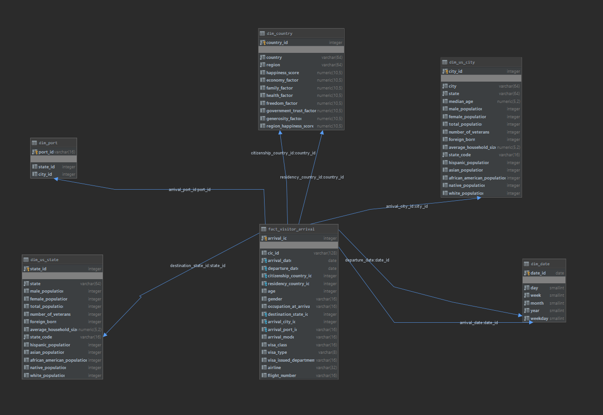
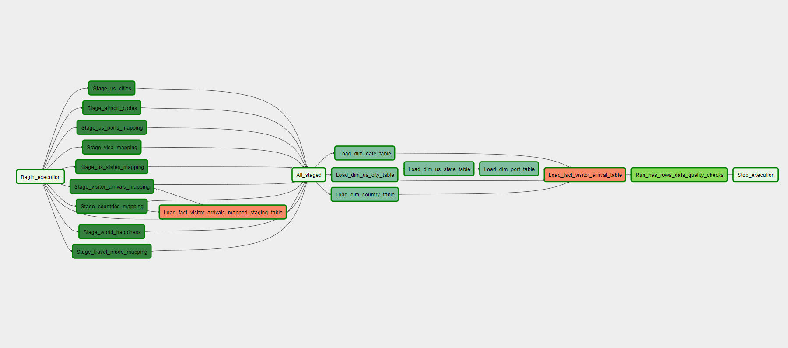
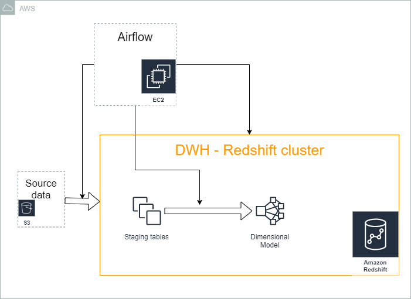

# Data Engineering Nanodegree Capstone project

Capstone project for the Udacity Data Engineering Nanodegree. With this project I intend to sumarise and demonstrate all the skills and technologies I have learned during the realisation of the course.

## Scope
For this project I have designed and implemented a Cloud Data Warehouse solution, to process raw data related to foreign visitor arrivals to the USA.

The data in its raw form is formed by multiple CSV, and Parquet files. The end result of the ETL process I have designed, is a star-shaped dimensional model, with the arrivals as facts, and the data that describes the facts as dimensions.

The dimensional model will reside in an Amazon Redshift Cluster. Since Redshift offers a Cloud managed, massive parallel processing DB, that will provide both easy scalability and high performance, without any upfront cost.

The pipeline will be designed as a DAG (Directed Acyclic Graph) in the data-pipeline tool Apache Airflow.

### Out of scope
This project does not go into the use of the created dimensional model to analyse it to obtain new intelligence. Even if that is not the case, the datasets were selected so it was possible to extract interesting information from the resulting model.

## Data
Four different datasets are used in this design. Three of them were suggested by Udacity, and the fourth one I added it myself, to enrich the resulting fact and allow more interesting analysis.

### I94 Visitor arrivals to the US
This data comes from the US National Tourism and Trade Office. Provides a count of visitor arrivals to the United States (1-night or more) to calculate U.S. travel and tourism volume exports.
The visitor arrivals will be the main dataset of the model, and the fact.

For this project, I had access to the data for all the arrivals during April 2016.

Origin: https://travel.trade.gov/research/reports/i94/historical/2016.html

__Data columns__:
1. cicid: Id like column
2. i94yr: arrival year
3. i94mon: arrival month
4. i94cit: country of citizenship of the traveller
5. i94res: country of residence of the traveller
6. i94port: arrival port
7. arrdate: arrival date
8. i94mode: travel mode (air, sea, land)
9. i94addr: State of Address of intended stay while in the US
10. depdate: Departure date
11. i94bir: Age
12. i94visa: Visa type (tourism, business, student)
13. count: _Unknown_
14. dtadfile: Date added
15. visapost: Visa issued department
16. occup: Occupation at destination (US)
17. entdepa: Arrival flag
18. entdepd: Departure flag
19. entdepu: Update flag
20. matflag: Match origin/destination flag
21. biryear: Birth year
22. dtaddto: Allowed date
23. gender: Gender
24. insnum: INS number
26. airline: Airline used to flight to the US
27. admnum: Id like column
28. fltno: Flight number of flight to the US
29. visatype: Visa type 

### Other datasets
* US cities demographics: data about the demographics of all US cities and census-designated places with a population greater or equal to 65,000.
* Airport codes: worldwide collection of airports, with their different identification codes, among other data.
* World happiness: data from the report World Happiness report per country. The happiness scores and rankings use data from the Gallup World Poll. The scores are based on answers to the main life evaluation question asked in the poll.
* _Global land temperatures_: global earth surface temperature data from 1750. Finest granularity by city, coarsest granularity by country. This dataset was discarded as there was no temporal intersection with the main data.

For more information about the datasets, and a more in-depth analysis of their fields and data, refer to the data explorations in the folder __data_exploration/__.

## Data model
As mentioned in the introduction, the transformed and enriched data is loaded into a Dimensional Model.

I decided to use a dimensional model, since it results in a easy to use model by analysts and improved analytical query performance.

Some columns from the source are not present in the final tables. In most cases, this is due to them being some kind of id with no valuable information, or its meaning was not clear.

### Facts and dimensions
The central event of this model, and the one that will be analysed, is the arrival of a foreign traveller to the US. And this event conforms the fact of the model.

The different aspects that describe the fact, such as time, and locations are the dimensions of the data model.

* __fact_visitor_arrival__: main event of the analysis. A visitor arrival
* __dim_date__: date dimension
* __dim_port__: port dimension, with city and state ids
* __dim_us_city__: city dimension, enriched with demographic information
* __dim_us_state__: state dimension, enriched with demographic information
* __dim_country__: country dimension (origin of the traveller). Enriched with information of happiness scores by country.

## ETL
The ETL process of moving and transforming the data from its raw sources to the dimensional model consists of the following general steps:
1. Extract the raw data from the S3 bucket where its stored into the staging tables.
2. Transform the data and link it.
3. Load it into the dimensional model.
4. Run quality checks on the data to check it is correct.

#### Extraction
It is done using the COPY command available from the Amazon Spectrum feature for Redshift, that allows to efficiently move and load multiple files from S3 into Redshift.

#### Transformation
The visitors arrival data requires some pre-processing before it could even be attempted to be joined with other tables. After that the tables can be joined to form the Dimensional Model.

#### Loading
Using INSERT INTO SELECT statements the data was loaded into the dimensional tables.

#### Data quality
In this case a simple quality check is implemented to check that the final tables contain any data.

### DAG
Airflow DAG representation of the pipeline.

## Infrastructure
The project was deployed in an all cloud environment.
* Source data: S3 bucket.
* Staging area & Dimensional model area: Redshift cluster of 4 dc2.large nodes.
* Airflow: Running in a EC2 t2.small linux instance.

## Defending decisions
#### Clearly state the rationale for the choice of tools and technologies for the project.
As I mentioned earlier, I chose to use Redshift, because it provides a Massive Parallel Processing database, with no upfront cost, and that can be deployed with a click of a button. It also allows easy scalability, and great performance, and does not require any management from my side.

I decided to use Apache Airflow because it allows me to clearly represent the pipeline that I designed as a graph, and makes its execution very simple.

#### Propose how often the data should be updated and why.
Depending on the analytic needs the data could be updated yearly, monthly or even daily. But due to the nature of the data, I think that a month worth of data would be the minimum size, if the goal is to extract a trend.

## Addressing other scenarios
#### The data was increased by 100x.
The data as it is loaded in the Redshift cluster takes 1.4GB of space. Taking into account that a 4 dc2.large nodes Redshift cluster can handle up to 640GB, it should be no problem to increase the size by 100.
#### The data populates a dashboard that must be updated on a daily basis by 7am every day.
Since the pipeline is already defined in Airflow, that can handle pipeline scheduling, it would only be required to defined the schedule, and adapt the extraction and loading step to take the execution date into account.
#### The database needed to be accessed by 100+ people.
I am not sure of the requests volume that the configuration I defined for the cluster can handle, but if it is not enough, it is possible to build multiple regions or multiple availability zones Redshift clusters.

## Further development
As I mentioned in some of the sections above, I made some decisions which goal was mainly simplify the task at hand, so it would not get extremely complex or laborious. As an acknowledgement of that, this is the list of possible improvements to this project.
1. Try to understand the meaning of some columns, that were ignored because its meaning was not obvious after a reasonable amount of research, and assess if they should be added to the data model.
2. Do more data quality. The data quality step was very useful for checking that the dimensional model tables were loaded, but it is the most simple check. In order to ensure maximum quality, it would be desirable to add additional checks based on the expected data.
